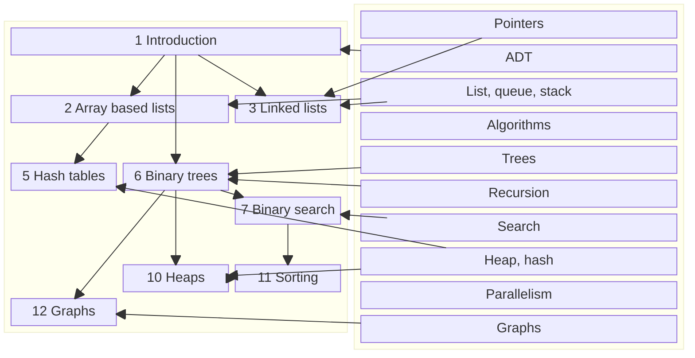

# Alineacion objetivos y capitulos

Este diagrama intenta parear los objetivos del curso (derecha) con los
capitulos del libro de texto (izquierda).

```mermaid
block-beta
block 
 columns 3
    c1["1 Introduction"]:3
    space:3
    c2["2 Array based lists"]:2
    c3["3 Linked lists"]
    space:3
    c5["5 Hash tables"]
    c6["6 Binary trees"]
    space:3
    c7["7 Binary search"]
    space:3
    space:1
    c10["10 Heaps"]
    c11["11 Sorting"]
    c12["12 Graphs"]
end
block
    columns 1
    o1["Pointers"]
    o2["ADT"]
    o3["List, queue, stack"]
    o4["Algorithms"]
    o5["Trees"]
    o6["Recursion"]
    o7["Search"]
    o8["Heap, hash"]
    o9["Parallelism"]
    o10["Graphs"]
end
c1-->c2
c1-->c3
c1-->c6
c2-->c5
c6-->c7
c6-->c10
c6-->c12
c7-->c11
c10-->c11
o1 --> c3
o2-->c1
o3-->c2
o3-->c3
o5-->c6
o6-->c6
o7-->c7
o8-->c5
o8-->c10
o10-->c12
```
