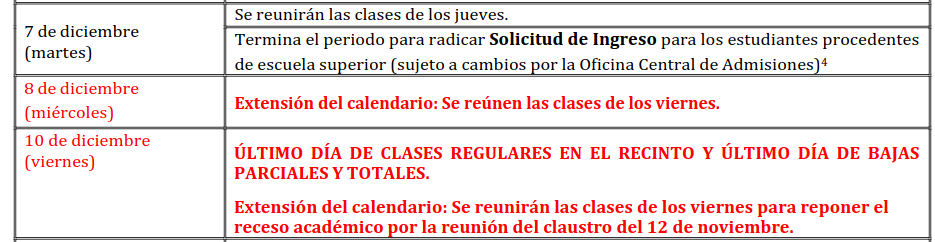

# Fechas en la iupi.

Como si las fechas y calendarios no fueran
[suficientemente complicados](https://github.com/kdeldycke/awesome-falsehood#dates-and-time),
el calendario en la UPR Rio Piedras tiene algunas
peculiaridades. Por ejemplo, el:

CALENDARIO ACADÉMICO ENMENDADO  
PRIMER SEMESTRE 2021---2022 (C11)  
(Agosto a Diciembre 2021)  
Enmendado el 12 de noviembre de 2021  

<https://www.uprrp.edu/wp-content/uploads/2021/11/111221-Calendario-Academico-C11-version-enmendada-al-11-12-2.pdf>

Tiene una semana interesante:



Implementemos una clase de fechas que puedan incorporar dias de la
semana alternos.

En este repositorio hay varios archivos, que juntos construyen un
programa que puede crear fechas, y probar los metodos. Los archivos
`Date.h` y `Date.cpp` declaran e implementan una clase para fechas,
pero solo tiene implementado un constructor vacio. El archivo
`main.cpp` tiene pruebas (construidas con funciones y macros de
`doctest.h`, [documentacion doctest](https://github.com/doctest/doctest/blob/master/doc/markdown/readme.md#reference), pero casi todos estan comentados.

Modifiquen estos 3 archivos para implementar y probar los metodos de
Date descritos abajo.

## Descargar el repositorio

Bajen el repositorio con git, o de github:
```
git clone https://github.com/humberto-ortiz/ccom3034-f2026.git
cd ccom3034-f2026
cd iupi-date
```

## Compilando

El archivo `CMakeFiles.txt` es un archivo de
[cmake](https://cmake.org/cmake/help/latest/guide/tutorial/index.html)
que describe como
compilar el programa. En el terminal pueden correr:

```
cmake -B build .
```
(el "." es importante, le dice que lea los archivos de este directorio.)
y luego armar el programa:
```
cmake --build build
```

Y entonces pueden correr el programa de prueba:
```
./build/main 
[doctest] doctest version is "2.4.12"
[doctest] run with "--help" for options
===============================================================================
[doctest] test cases: 1 | 1 passed | 0 failed | 0 skipped
[doctest] assertions: 1 | 1 passed | 0 failed |
[doctest] Status: SUCCESS!
```

### Compilacion sin cmake

Si cmake es un problema, pueden compilar el programa con g++:

```
g++ Date.cpp main.cpp -o main
./main
[doctest] doctest version is "2.4.12"
[doctest] run with "--help" for options
===============================================================================
[doctest] test cases: 1 | 1 passed | 0 failed | 0 skipped
[doctest] assertions: 1 | 1 passed | 0 failed |
[doctest] Status: SUCCESS!
```

## Metodos

Implementen los siguientes metodos, y verifiquen en main.cpp que las prueas de doctest funcionan.

 - Constructors
   - Date() – Default constructor. Initializes the object to 1903-01-01 (January 1, 1903)
   - Date(aYear: int, aMonth: int, aDay: int) – Initializes the object with the given values if they represent a valid date. If not, it should throw a [std::invalid_argument](https://cppreference.com/cpp/error/invalid_argument) exception.
   - Date(aYear: int, aMonth: int, aDay: int, altDay: string) - Initializes the object with the given values if they represent a valid date. If not, it should throw a std::invalid_argument exception. The `altDay` argument should denote a alternate weekday (e.g. Date(2021,12,8, "viernes") represents the second date in the above example calendar.

 - valid(year: int, month: int, day: int): returns true if values represent a valid date (from the year 1903 on).
 - same(d: Date): returns true if the invoking object and the parameter object represent the same date. Two dates are the same even if they have different alternate strings.
 - getDayOfWeek(): returns a string for the day of the week. See explanation in the next section.

## Dias de la semana.

El archivo `dow.cpp` tiene una funcion para calcular el dia de la
semana que corresponde a una fecha. Hay muchas maneras de calcularlo,
pueden ver algunas en
[wikipedia](https://en.wikipedia.org/wiki/Determination_of_the_day_of_the_week).

Esta funcion presume que se está utilizando el [calendario
Gregoriano](https://en.wikipedia.org/wiki/Gregorian_calendar), que se
instituyó en 1592 en España, poco después en las colonias españolas, y
en 1752 en el Imperio Britanico. Desde la fundacion de la UPR en 1903,
se utiliza el calendario Gregoriano.

El metodo getDayOfWeek() debe devolver un string con el dia de la semana, y si hay un dia alterno, indicarlo. Por lo tanto las siguientes pruebas deben pasar.
```
TEST_CASE("Testing dayOfWeek") {
    CHECK(Date(2026,8,26).getDayOfWeek() == "miércoles");
    CHECK(Date(2021,12,8,"viernes").getDayOfWeek() == "miércoles, pero se reunen las clases de los viernes");
}
```
